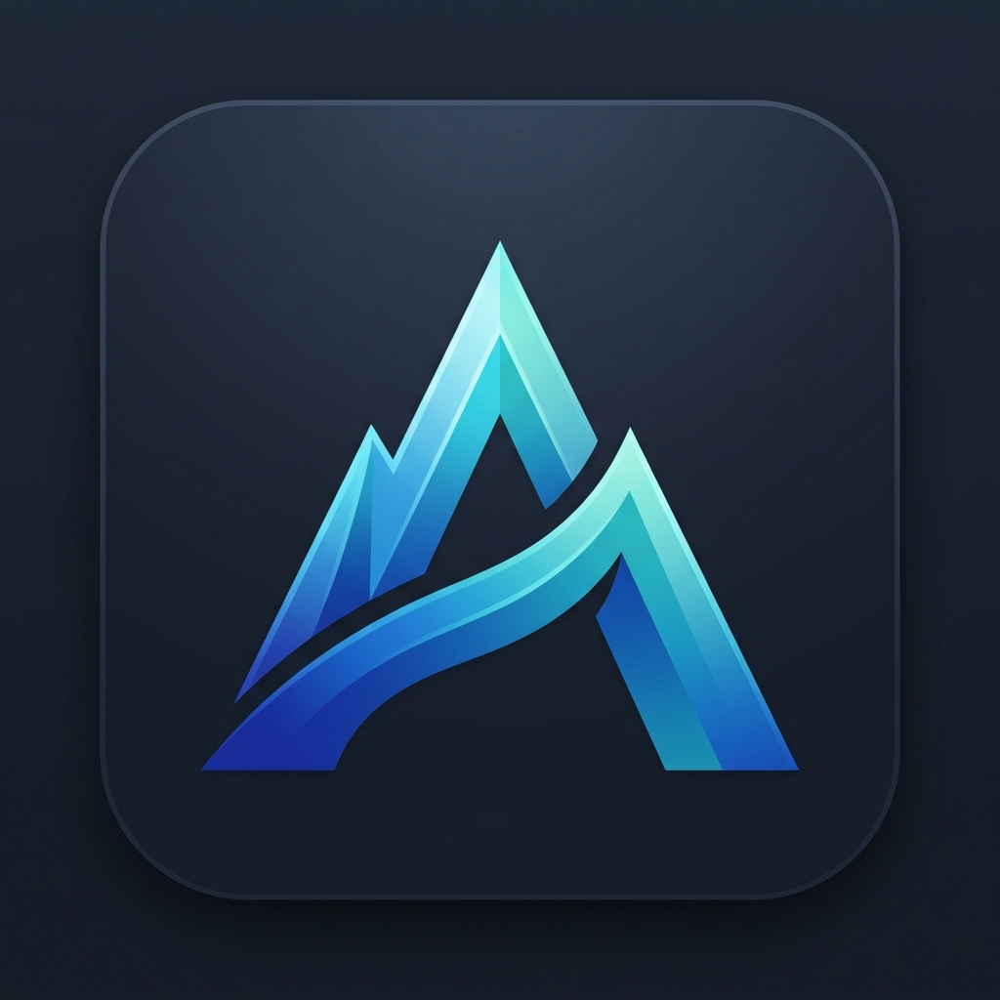
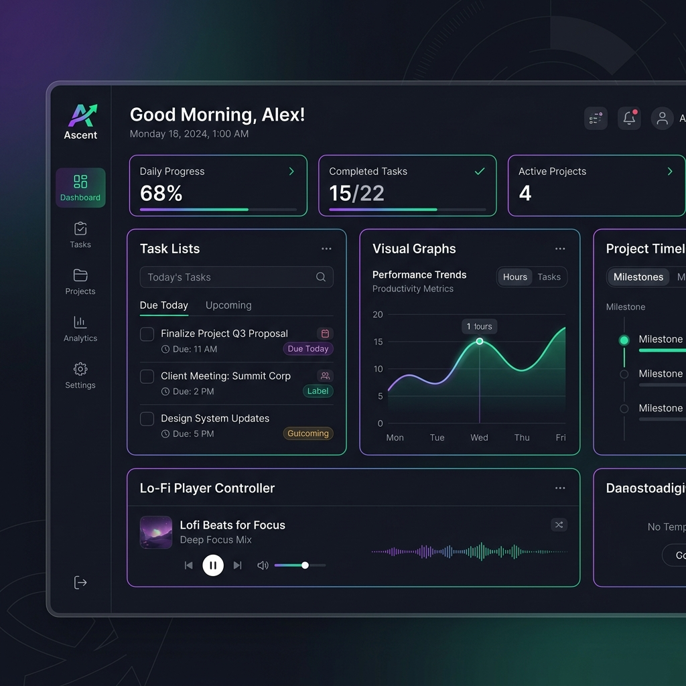
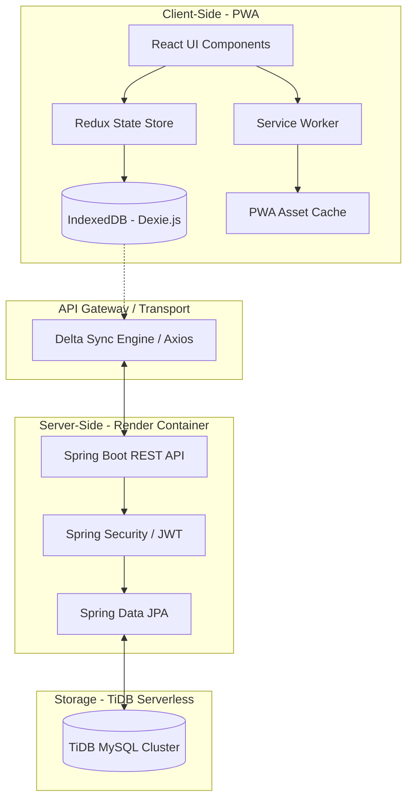
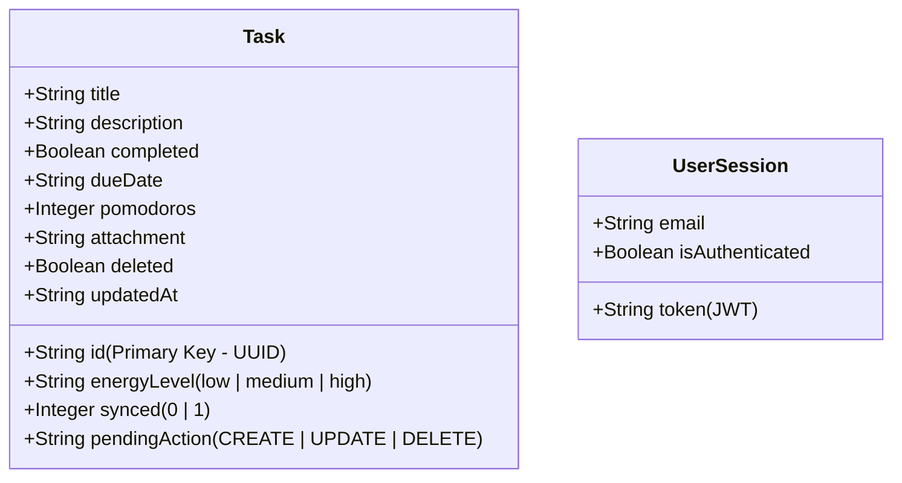

#  Ascent - Offline-First Task Management App

Ascent is a premium, offline-first task management application built using a modern **React SPA + Java Spring Boot + MySQL / TiDB** architecture. It is fully responsive, supports standalone PWA installation, and is optimized for both desktop and mobile viewports.



---

## 🗺️ High-Level Design (HLD)

Ascent is architected with a decoupled Client-Server layout. The frontend operates offline-first, executing all transactions instantly on local storage and synchronizing data dynamically when online.



---

## 🛠️ Low-Level Design (LLD)

### Local Database Schema (IndexedDB / Dexie.js)
Tasks are persisted on the client using IndexedDB. Since tasks can be generated offline, Ascent uses UUIDs as primary keys to avoid collision.



### Relational Database Schema (MySQL / TiDB)
```sql
CREATE TABLE users (
    id BIGINT AUTO_INCREMENT PRIMARY KEY,
    email VARCHAR(100) NOT NULL UNIQUE,
    password VARCHAR(255) NOT NULL,
    share_token VARCHAR(50),
    created_at TIMESTAMP,
    updated_at TIMESTAMP
);

CREATE TABLE tasks (
    id VARCHAR(36) PRIMARY KEY,
    user_id BIGINT NOT NULL,
    title VARCHAR(255) NOT NULL,
    description TEXT,
    completed BOOLEAN DEFAULT FALSE,
    due_date TIMESTAMP NULL,
    deleted BOOLEAN DEFAULT FALSE,
    created_at TIMESTAMP,
    updated_at TIMESTAMP,
    FOREIGN KEY (user_id) REFERENCES users(id) ON DELETE CASCADE
);
```

---

## 🚀 Key Feature Functionality

### 1. Date & Time Picker Enhancements
* **Natural Language Parsing**: An integrated search bar that instantly translates text (e.g. `"tomorrow at 5pm"`) to dates and sets the calendar.
* **Relative Quick Presets**: Rapidly shift deadlines with relative increments (e.g. `+30m`, `+2h`, `+1d`).
* **Timezone Configurator**: Shift deadlines dynamically across timezones.

### 2. Focus & Cognitive Wellness
* **Lo-fi Synthesizer & Noise Generators**: Built-in sound engines generating Pink/Brown noise directly inside the browser.
* **Breathing Guides**: Visual rhythmic patterns facilitating focused workflow sessions.
* **Energy Tagging**: Filter tasks based on your current self-reported mental energy level (`High Focus`, `Routine`, `Brain Dead`).

### 3. Collaborative Drawing Whiteboard
* Draw directly inside task cards to sketch mockups or notes, saved locally on the canvas.

### 4. PWA Installation
* Supports standalone launch on iOS and Android with customized app icons, transparent status bars, and persistent desktop service workers.

---

## ⚡ Deployment & Cloud Stack Configuration

### Frontend (Vercel)
Vercel reads `vercel.json` to configure rewrite rules, allowing client-side React Router navigation to handle virtual routes without routing errors.
* **Env Variable**: Set `VITE_API_URL` to your Render service address (e.g. `https://ascent-api.onrender.com/api`).

### Backend (Render Web Service)
Builds the Java project using the containerized multi-stage `Dockerfile`.
* **Runtime**: Docker
* **Env Variables**: Add DB host, user credentials, and `APP_JWT_SECRET`.

### Database (TiDB Serverless)
MySQL-compatible serverless database cluster. Ensure connection URLs enforce secure SSL encryption:
```
jdbc:mysql://<TIDB_HOST>:4000/<DB>?sslMode=VERIFY_IDENTITY&enabledTLSProtocols=TLSv1.2,TLSv1.3
```

---

## ⚙️ Environment Variables Setup

Ascent uses separate environment configuration files for different stages. Rename any of the root example files to `.env` or place them inside `frontend/` to customize settings:

* **Development Template**: [`.env.development.example`](file:///d:/Task%20Management%20App/.env.development.example)
  - Configured to point to `http://localhost:8080/api`.
* **Staging Template**: [`.env.staging.example`](file:///d:/Task%20Management%20App/.env.staging.example)
  - Points to the staging server domain.
* **Production Template**: [`.env.production.example`](file:///d:/Task%20Management%20App/.env.production.example)
  - Points to the live Render backend deployment url.

---

## 🏃 How to Run the Application

### 1. Development Environment (Local)
Run both frontend and backend on your local machine:
```bash
# Start backend (from backend directory)
mvn spring-boot:run

# Start frontend (from frontend directory)
npm install
npm run dev
```

### 2. Staging Environment
Test builds locally or on a staging server:
```bash
# Backend (using staging profile)
mvn spring-boot:run -Dspring-boot.run.profiles=staging

# Frontend
npm run build -- --mode staging
npm run preview
```

### 3. Production Environment
Deploy optimized builds using Docker and compiled static assets:
```bash
# Backend Docker build (runs on Render via Dockerfile)
docker build -t ascent-backend ./backend
docker run -p 8080:8080 -e SPRING_PROFILES_ACTIVE=prod ascent-backend

# Frontend build (deploys to Vercel via vercel.json rewrite rules)
npm run build
```

---

## ⚠️ Known Limitations & Constraints

* **Private Browsing / Incognito Mode**: Some web browsers disable persistent IndexedDB access in Incognito mode. As a result, local tasks might not survive tab closures.
* **Notifications Support**: Web Reminders and Push notification alerts require explicit browser notification permissions. If blocked, alerts fall back to in-app banners.
* **Conflict Resolution Constraint**: Concurrency conflicts are solved using a Last-Write-Wins (LWW) mechanism. If two devices modify the same task offline, the device that connects last and triggers a sync will overwrite previous changes.

